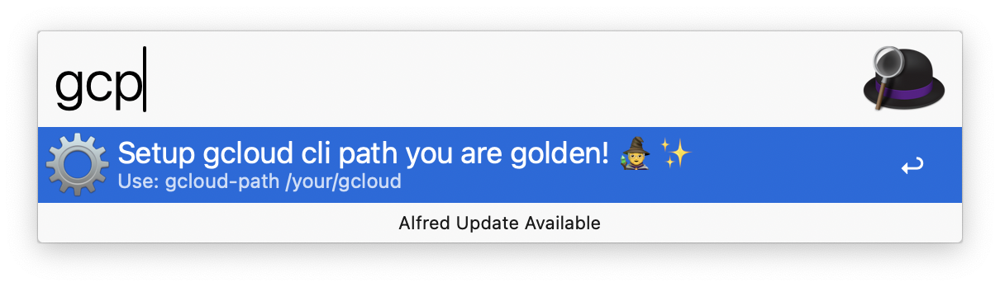
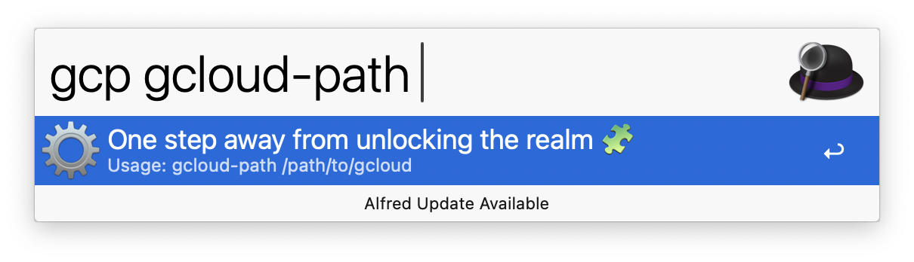
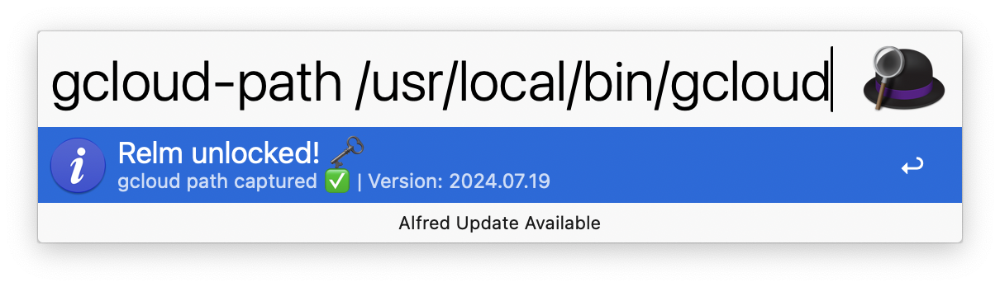

# Installation

First off, **I'm sorry you're reading this!**  
You probably ran into an issue during setup, and this page is here to get you back on track.  
You weren’t supposed to land here, but no worries, I’ll guide you through it step by step. 

---

### 1. Prerequisites

Make sure you have the [Google Cloud CLI](https://cloud.google.com/sdk/docs/install) installed and authenticated.

To check if it’s available:

```bash
which gcloud
```

If that prints a valid path (like `/Users/you/google-cloud-sdk/bin/gcloud`), you're good to go ✅

---

### 2. Install the Workflow

1. Download the latest release from the [GitHub Releases page](https://github.com/dineshgowda24/alfred-gcp-workflow/releases).
2. Double-click the `.alfredworkflow` file — it will open in Alfred and install the workflow.
3. Open Alfred and type `gcp`. For the **first and only time**, you’ll be prompted to complete a quick setup.

---

### 3. Set the `gcloud` Binary Path

When prompted:

- Use <kbd>Tab</kbd> to select the `gcloud-path` setup option  
  

- Alfred will then ask you to enter the path to your `gcloud` binary  
  

To find your path, run:

```bash
which gcloud
```

Copy the result and paste it into Alfred. If it's correct, you’ll see a ✅ success message.  


---

### 4. You’re All Set!

Now just hit <kbd>Enter</kbd> or <kbd>Tab</kbd> again to go to the home screen of the workflow.

From here, you can explore services, search resources, or manage configurations, all with Alfred's lightning-fast speed.  


---

## Troubleshooting

If you're still stuck, feel free to [open an issue on GitHub](https://github.com/dineshgowda24/alfred-gcp-workflow/issues) — I’ll get back to you as soon as possible.
