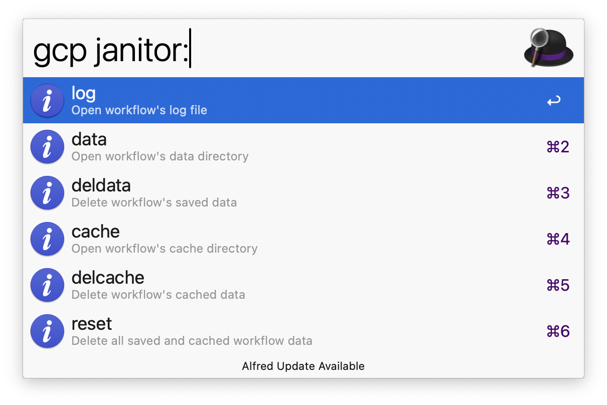

#  alfred-gcp-workflow

An Alfred workflow to quickly open GCP services in your browser or search GCP resources with ease.

## Installation

1. Make sure you have the [Google Cloud Cli](https://cloud.google.com/sdk/docs/install) installed and authenticated.
2. Download the latest release from the [releases page](https://github.com/dineshgowda24/alfred-gcp-workflow/releases)
3. Unzip the downloaded file and open the `.alfredworkflow` file to import it into Alfred app.
4. Set the **`ALFRED_GCP_WORKFLOW_GCLOUD_PATH`** environment variable to point to your gcloud executable.
**(This is required for the workflow to function properly.)**
5. (Optional) Set the `ALFRED_GCP_WORKFLOW_GCLOUD_CONFIG` environment variable if your gcloud configuration is located somewhere other than the default `~/.config/gcloud` directory.

## Usage

1. Open Alfred and type `gcp` to see the available services and commands.
2. The home page will display useful links to Google Cloud:

> Example: Home screen with quick links to GCP Console, Health Status, and Services
1. Type `gcp` followed by a service name. For example, `gcp compute` will show the Compute Engine service.
2. If a service has 🗂️ in its subtitle, press  <kbd>Tab</kbd> to autocomplete into the subservices section — to navigate to redis inside memorystore.
3. You can filter subservices directly by typing their name. For example, `gcp compute instances` will show Compute Engine instances.
4. If a subservice has 🔍⚡️ in its subtitle, it supports **resource search**. For example, after typing `gcp compute` you can <kbd>Tab</kbd> into `instances` to list them.
5. The workflow uses your currently active gcloud configuration by default. To override it, type `@` in your query to list and select from your available configurations.

### Advanced Usage

1. The workflow supports janitor actions [janitor actions](https://pkg.go.dev/github.com/deanishe/awgo#MagicAction)**(powered by AwGo Magic Actions)** to manage internal workflow data. Type `gcp janitor:` to view available options — such as clearing cache, accessing logs, or resetting data folders.

> Example: View showing available janitor actions
1. The workflow also supports [Fuzzy Filtering](https://pkg.go.dev/github.com/deanishe/awgo/fuzzy), allowing you to quickly find services or resources even with partial or out-of-order matches.

## Contributing

Please read the [contributing guidelines](CONTRIBUTING.md) for details on how to set up your environment and submit changes.

## License

This project is licensed under the MIT License. See the [LICENSE](LICENSE) file for full license information.

## Acknowledgements 🙏

This workflow is inspired by the amazing [aws-alfred-workflow](https://github.com/rkoval/alfred-aws-console-services-workflow).
As a past user of that workflow before switching to GCP, I wanted to create a similar experience for GCP users.
Huge thanks to the original author for the idea and inspiration — without which this workflow wouldn't exist!