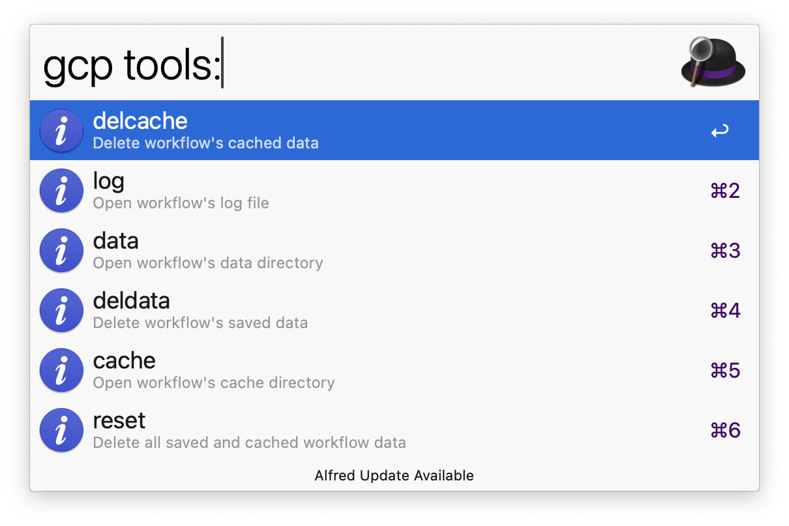

#  alfred-gcp-workflow

An Alfred workflow to quickly open GCP services in your browser or search GCP resources with ease.

## Installation

1. Make sure you have the [Google Cloud CLI](https://cloud.google.com/sdk/docs/install) installed and authenticated.
2. Download the latest release from the [releases page](https://github.com/dineshgowda24/alfred-gcp-workflow/releases).
3. Double-click the downloaded `.alfredworkflow` file to install it in Alfred.
4. Follow the instructions in the workflow to set up your gcloud binary path and you are good to go!

> 🆘 **Still stuck?** [Read the full installation guide](INSTALLATION.md) for step-by-step help.

## Design Philosophy

This workflow is built to be fast, secure, and effortless. It never sees your credentials — authentication stays with the gcloud CLI. It only caches safe, non-sensitive data to keep things snappy. Every command fetches just the fields it needs, so there's no noise or overhead. Set it up once, and it just works — no surprises.

If you notice anything that feels otherwise, it's unintentional — please open an issue.

## Usage

1. Open Alfred and type `gcp` to see the available services and commands.
2. The home page will display useful links to Google Cloud:  
     
   _Example: Home screen with quick links to GCP Console, Health Status, and Services._
3. Type `gcp` followed by a service name.  
   _Example: `gcp compute` will show the Compute Engine service._
4. If a service has 🗂️ in its subtitle, press <kbd>Tab</kbd> to autocomplete into the subservices section (e.g., navigate to Redis inside Memorystore).
5. You can filter subservices directly by typing their name.  
   _Example: `gcp compute instances` will show Compute Engine instances._
6. If a subservice has 🔍⚡️ in its subtitle, it supports **resource search**.  
   _Example: after typing `gcp compute`, tab into `instances` to list them._  
   [See full list of searchable resources.](#️-supported-resource-searches)
7. The workflow uses your currently active gcloud configuration by default.  
   To override it, type `@` in your query to list and select from available configurations.
8. To query a specific region, type `$` in your query to list and select from available regions.

---

### ⚠️ Heads up about regions

- Not all services support all regions. The workflow checks if the selected region is valid **before** calling `gcloud`, so you'll get immediate feedback instead of a failure.
- Some resources are **global**, meaning they aren't tied to a region or zone. Selecting a region won't affect those results.

**Examples of global resources:**
- Compute snapshots  
- Compute instance templates  
- Pub/Sub topics and subscriptions  
_This is not an exhaustive list — if changing the region has no effect, the resource is likely global._

### Advanced Usage

1. Access maintenance tools powered by [AwGo Magic Actions](https://pkg.go.dev/github.com/deanishe/awgo#MagicAction) by typing `gcp tools:`.  This gives you options to clear cache, view logs, or reset internal data folders.
    
   _Example: Maintenance tools screen with options like clear cache and view logs._  
2. The workflow supports [Fuzzy Filtering](https://pkg.go.dev/github.com/deanishe/awgo/fuzzy), so you can quickly find services or resources — even with partial or out-of-order matches.

## 🔍⚡️ Supported Resource Searches

Here are the GCP resources currently searchable through the workflow:

| Service | Resource |
|---------|----------|
| 🛢️ Cloud SQL | Instances |
| 🧠 Memorystore | Redis Instances |
| 📬 Pub/Sub | Topics, Subscriptions |
| 📦 Storage | Buckets |
| 🖥️ Compute Engine | Instances, Disks, Images, Instance Templates, Machine Images, Snapshots |
| ☸️ Kubernetes Engine (GKE) | Clusters |
| 🗄️ Filestore | Instances |
| 🌐 Cloud DNS (Network Services) | DNS Zones |
| 🛤️ VPC | Networks, Routes |
| 🔐 Network Connectivity | VPN Tunnel, VPN Gateway, Cloud Router |
| 🗃️ Artifact Registry | Repositories |
| 🏃‍♂️ Cloud Run | Functions (Gen1), Services (Gen2) |
| 📋 Cloud Tasks | Queues |

## Contributing

Please read the [contributing guidelines](CONTRIBUTING.md) for details on how to set up your environment and submit changes.

## License

This project is licensed under the MIT License. See the [LICENSE](LICENSE) file for full license information.

## Donate ♥️

If this workflow saved you some time or made things easier, feel free to show some love 

## 🙏 Acknowledgements

This workflow is inspired by the amazing [aws-alfred-workflow](https://github.com/rkoval/alfred-aws-console-services-workflow).
As a past user of that workflow before switching to GCP, I wanted to create a similar experience for GCP users.
Huge thanks to the original author for the idea and inspiration — without which this workflow wouldn't exist!