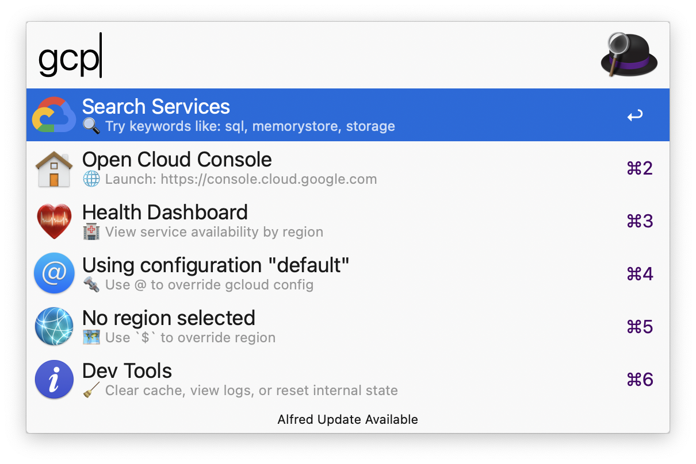

#  alfred-gcp-workflow

An Alfred workflow to quickly open GCP services in your browser or search GCP resources with ease.

## 🛠️ Installation

1. Make sure you have the [Google Cloud CLI](https://cloud.google.com/sdk/docs/install) installed and authenticated.
2. Download the latest release from the [releases page](https://github.com/dineshgowda24/alfred-gcp-workflow/releases).
3. Double-click the downloaded `.alfredworkflow` file to install it in Alfred.
4. Follow the instructions in the workflow to set up your gcloud binary path and you are good to go!

> 🆘 **Still stuck?** [Read the full installation guide](installation.md) for step-by-step help.

## 🧠 Design Philosophy

This workflow is built with a strong focus on security, performance, and keeping things dead simple.
1. **No secrets, ever**  
    Auth stays with the gcloud CLI. The workflow never sees your tokens, credentials, or anything private.
2. **Only cache what’s safe**  
    Things like project IDs, region names, resource names, timestamps etc — never sensitive data. Just enough to speed things up.
3. **One-time setup, then smooth sailing**  
    Set your `gcloud` path once, and you’re good to go.
4. **Efficient by default**  
    Every gcloud command fetches just the fields it needs using `--format=json(...)`. No noise, no bloat.
5. **You’re always in control**  
    Switch configs with `@`, reset anything with `tools:`. What you see is what’s running — nothing hidden, nothing weird.

## ⌨️ Usage

1. Open Alfred and type `gcp` to see the available services and commands.
2. The home page will display useful links to Google Cloud:

> Example: Home screen with quick links to GCP Console, Health Status, and Services
1. Type `gcp` followed by a service name. For example, `gcp compute` will show the Compute Engine service.
2. If a service has 🗂️ in its subtitle, press  <kbd>Tab</kbd> to autocomplete into the subservices section — to navigate to redis inside memorystore.
3. You can filter subservices directly by typing their name. For example, `gcp compute instances` will show Compute Engine instances.
4. If a subservice has 🔍⚡️ in its subtitle, it supports **resource search**. For example, after typing `gcp compute` you can <kbd>Tab</kbd> into `instances` to list them. [See full list of searchable resources.](#-supported-resource-searches)
5. The workflow uses your currently active gcloud configuration by default. To override it, type `@` in your query to list and select from your available configurations.
6. There are instances where you might want to query for a specific region. You can override the default region by typing `$` in your query to list and select from your available regions.

> ⚠️ **Heads up about regions**
> 
> - Not all services support all regions. The workflow checks if the selected region is supported for the resource **before** calling `gcloud`, so you'll get immediate feedback instead of a failure.
> - Some resources are **global**, meaning they aren't tied to any region or zone. In these cases, selecting a region won't affect the result.
>
> **Examples of global resources:**
> - Compute snapshots  
> - Compute instance templates  
> - Pub/Sub topics and subscriptions  
>
> _This is not an exhaustive list._ If changing the region has no effect on the results, the resource is likely global.

### ⌨️ Advanced Usage

1. The workflow supports maintenance tools powered by [AwGo Magic Actions](https://pkg.go.dev/github.com/deanishe/awgo#MagicAction). Type `gcp tools:` to access options like clearing cache, viewing logs, or resetting internal data folders.

> Example: View showing available maintenance tools
1. The workflow also supports [Fuzzy Filtering](https://pkg.go.dev/github.com/deanishe/awgo/fuzzy), allowing you to quickly find services or resources even with partial or out-of-order matches.

## 🔍⚡️ Supported Resource Searches

Here are the GCP resources currently searchable through the workflow:

| Service | Resource |
|---------|----------|
| 🛢️ Cloud SQL | Instances |
| 🧠 Memorystore | Redis Instances |
| 📬 Pub/Sub | Topics, Subscriptions |
| 📦 Storage | Buckets |
| 🖥️ Compute Engine | Instances, Disks, Images, Instance Templates, Machine Images, Snapshots |
| ☸️ Kubernetes Engine (GKE) | Clusters |
| 🗄️ Filestore | Instances |
| 🌐 Cloud DNS (Network Services) | DNS Zones |
| 🛤️ VPC | Networks, Routes |
| 🔐 Network Connectivity | VPN Tunnel, VPN Gateway, Cloud Router |
| 🗃️ Artifact Registry | Repositories |
| 🏃‍♂️ Cloud Run | Functions (Gen1), Services (Gen2) |
| 📋 Cloud Tasks | Queues |

## ♥️ Contributing

Please read the [contributing guidelines](CONTRIBUTING.md) for details on how to set up your environment and submit changes.

## License

This project is licensed under the MIT License. See the [LICENSE](LICENSE) file for full license information.

## 🙏 Acknowledgements

This workflow is inspired by the amazing [aws-alfred-workflow](https://github.com/rkoval/alfred-aws-console-services-workflow).
As a past user of that workflow before switching to GCP, I wanted to create a similar experience for GCP users.
Huge thanks to the original author for the idea and inspiration — without which this workflow wouldn't exist!